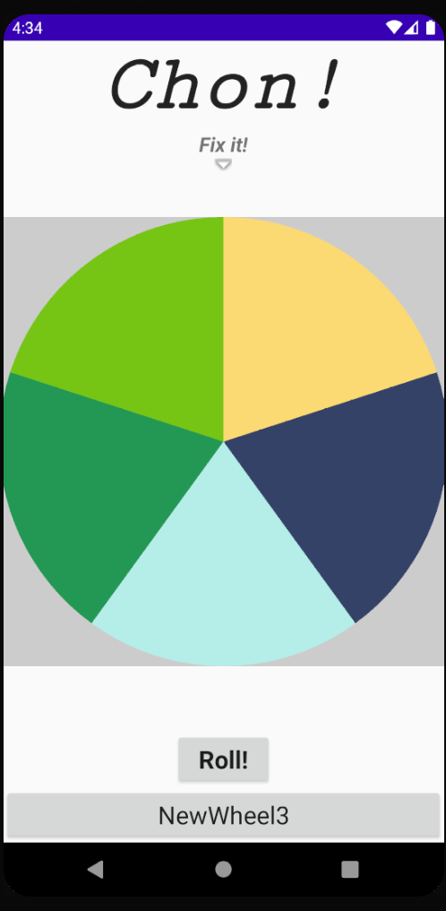
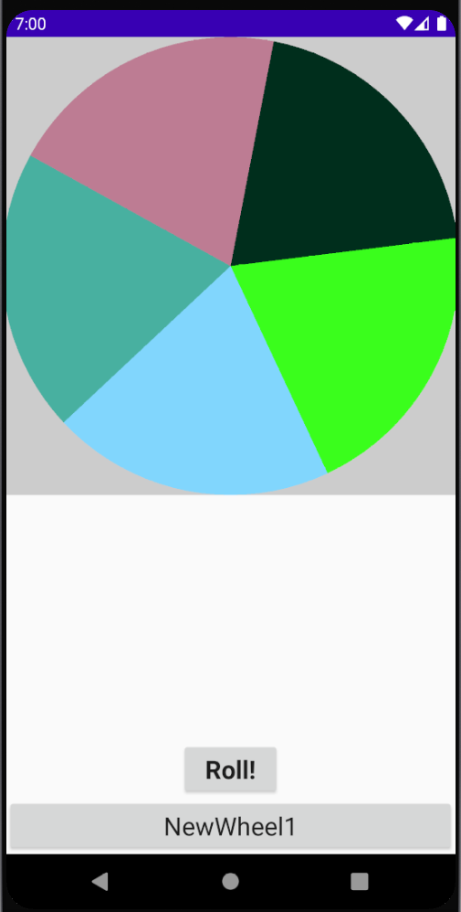
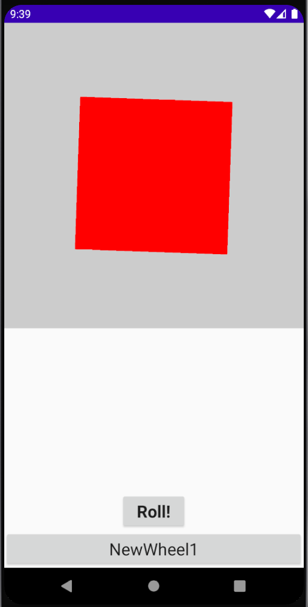
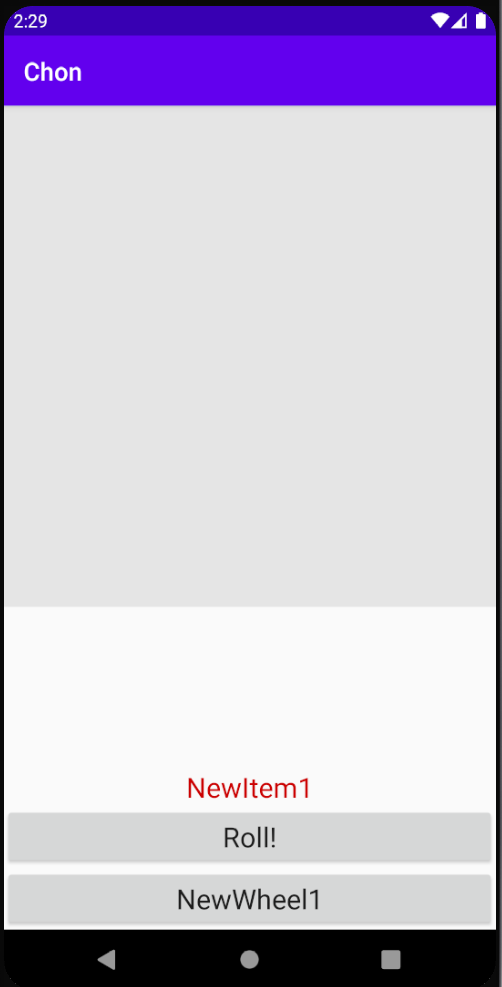
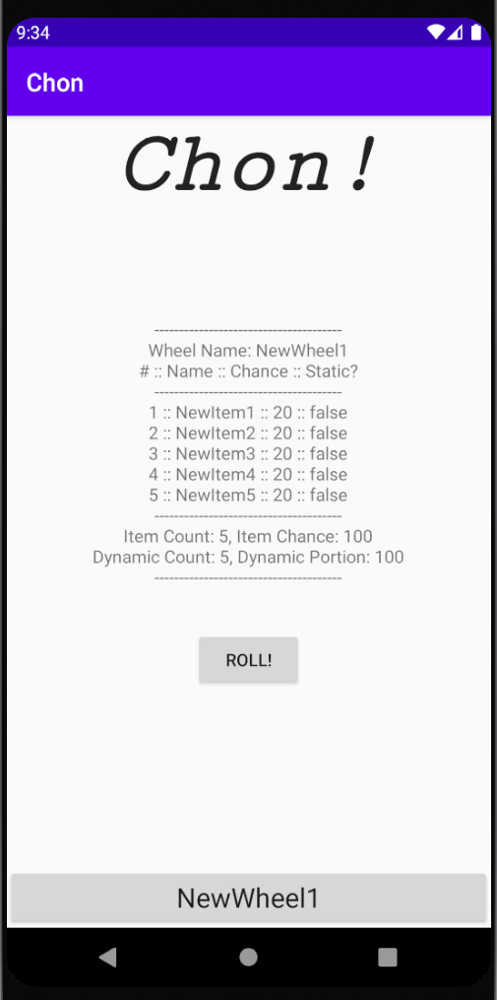

# Chon
Get Sean (Chon) to finally pick something to watch while we wait for this pandemic to end society as we know it!

Chon is an Android (possibly iOS in the future) app developed with a single purpose in mind: spend less time scrolling through Netflix and more time indulging in self-destructive lifestyles. This app features several slices that can take up a wheel, and the wheel is spun to allow users to randomly decide on a place to eat, movie to watch, or TV show to blare in the background of playing Animal Crossing: New Horizons.

# Known Bugs
- There is no confirmation for discarding or deleting wheels
- Static field editor keeps changing pointer on field change

# Log

### 6/04/20

For version 0.5, I animated the wheel to actually match the randomly selected item. In addition, I updated the UI to point at the rendering context selection. In the future, I’ll focus on keeping colors consistent and labeling which items correspond to which color.

### 6/03/20

For version 0.4, I’ve addressed bugs related to automatically loading the saved wheel, and dynamically changing dynamic item chances when static chances are altered. As for new features, the name fields have been increased by 50%, and the renderer now displays a spinning wheel with color-coded sections. In the next update, I will be focusing on actually animating this wheel, and programming a better way to determine colors.

### 5/28/20

For version 0.3, some bugs have been ironed out. This includes bugs when transitioning to new activities, the back button returning to old save states, and a memory leak when removing wheel objects under certain circumstances. In addition, a rendering context has been added, and a rotating square is being rendered. In the next version, a wheel representing a wheel data object will be rendered onto the canvas.

### 5/21/20

For this version, I fixed a few bugs related to blank naming schemes for item and wheel name editors. In addition, I fixed a bug that caused a crash when all items are set to static. I also uploaded an OpenGL library and added a rendering context to the main menu. Eventually, this will render a spinning wheel representing the loaded wheel data.

### 5/20/20

For the initial v0.1 release of this app, I implemented the basic functionality of this app with a minimalistic UI. This version includes the ability create, save, load, and delete wheel objects to your Android device. The editor also validates input to make sure that there are no duplicate wheel names or wheel items within a wheel. Loading a wheel object in the main menu allows you to “roll” and get a random item within your wheel while playing a fun song in the background. There are still a lot of features to implement and bugs to fix, but I’ve managed to develop a decent base to work off of.
